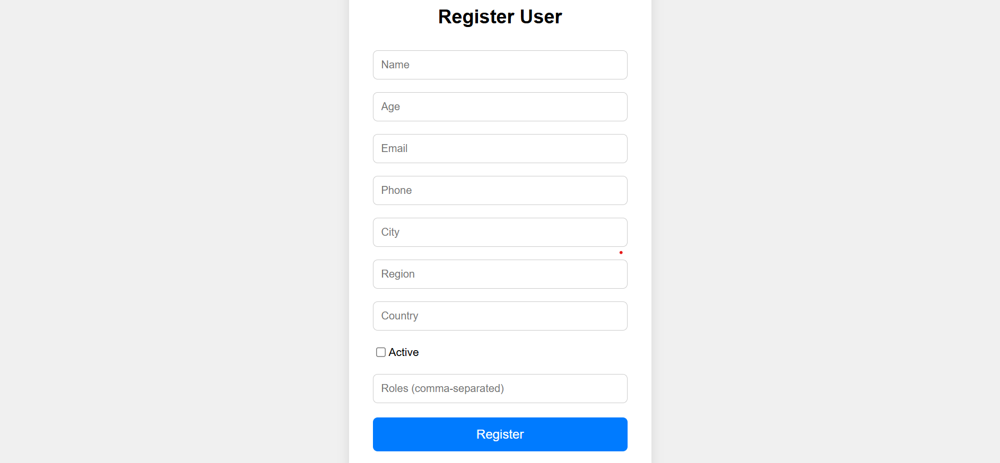

# 🧑‍💼 User Directory App

A fullstack web application for registering and managing user profiles with role-based access and MongoDB integration.

📁 **Repository**: [github.com/bati58/UserRegistrationFormat](https://github.com/bati58/UserRegistrationFormat)

---

## 🌐 Live Demo

👉 [Open the registration form in browser](https://bati58.github.io/UserRegistrationFormat/frontend/index.html)

> This link uses GitHub Pages to preview your form directly in the browser.

---

## 🖼 Registration Form UI

Attaced  screenshot of registration format👌:

## 🚀 Features

- User registration with validation for name, age, email, phone, address, and roles
- Frontend form with real-time validation and dark mode toggle
- Backend API built with Express and Node.js
- MongoDB database for persistent user storage
- Role-based structure (`admin`, `user`, `editor`)
- Active status toggle for users
- Clean UI with confirmation dialog on successful registration

---

## 🛠 Tech Stack

- **Frontend**: HTML, CSS, JavaScript
- **Backend**: Node.js, Express
- **Database**: MongoDB
- **Dev Tools**: nodemon, fetch API, curl

---

